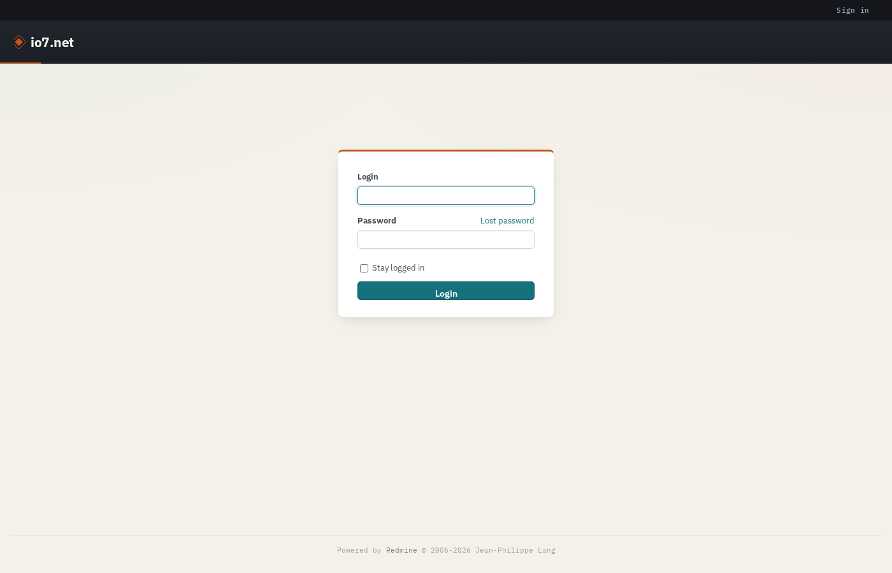

# Engineering Ledger — a theme for Redmine 6

A refined, technical-editorial theme for **Redmine 6.x**. Ink-dark chrome over a
warm paper canvas, petrol and rust accents, and IBM Plex Sans + Mono for the
data-dense screens Redmine is full of.



## Highlights

- Dark "engineering" header and main menu with a rust signature hairline
- Warm paper content canvas with crisp white cards and soft shadows
- Monospace (IBM Plex Mono) for IDs, dates, durations and other tabular data
- Petrol interaction colour, rust for identity/emphasis, tuned status palettes
- Reworked forms, buttons, tables, journals, flash messages, login and the
  query Options panel
- Responsive-aware: respects Redmine's own mobile breakpoints (no desktop-only
  overrides leaking into the hamburger layout)

## Requirements

- Redmine **6.0+** (uses the Rails asset pipeline; themes live under
  `app/assets/themes/`)
- Outbound access to Google Fonts, or self-host IBM Plex and adjust the
  `@import` at the top of `stylesheets/application.css` (see *Offline / self-hosted fonts*)

## Installation

The theme **must** be installed into a directory named `engineering-ledger` —
Redmine derives the body class (`theme-Engineering-ledger`) from the directory
name, and every selector in this theme is scoped to that class.

```bash
cd /path/to/redmine

# Clone into the correctly-named theme directory
git clone https://github.com/io7/redmine-engineering-ledger.git \
  app/assets/themes/engineering-ledger

# Compile the theme into public/assets
RAILS_ENV=production bin/rails assets:precompile

# Restart your Redmine app server (systemd unit name will vary)
sudo systemctl restart redmine-puma
```

Then enable it: **Administration → Settings → Display → Theme →
"Engineering-ledger" → Save.**

> Installing by downloading the ZIP instead of cloning? Unpack it and rename the
> extracted folder to `engineering-ledger` before placing it in
> `app/assets/themes/`.

## Updating

```bash
cd /path/to/redmine/app/assets/themes/engineering-ledger
git pull
cd /path/to/redmine
RAILS_ENV=production bin/rails assets:precompile
sudo systemctl restart redmine-puma
```

## Customisation

The palette and radii are CSS custom properties declared in `:root` at the top
of `stylesheets/application.css`. Override what you like — e.g. swap the accent:

```css
:root {
  --accent:   #15727d;  /* petrol — interaction        */
  --warm:     #c2581f;  /* rust   — identity / emphasis */
  --paper:    #f4f1ea;  /* canvas                       */
  --radius:   5px;
}
```

After editing, re-run `assets:precompile` and restart.

### Offline / self-hosted fonts

Line 2 of `stylesheets/application.css` pulls IBM Plex from Google Fonts. To run
without external requests, download IBM Plex Sans + Mono, drop the `@font-face`
declarations into this file (or a sibling), and remove the Google Fonts
`@import`. The theme falls back to the system sans/mono stack if the fonts are
unavailable.

## Uninstall

Set the theme back to the default in **Administration → Settings → Display**,
then:

```bash
rm -rf /path/to/redmine/app/assets/themes/engineering-ledger
RAILS_ENV=production bin/rails assets:precompile
sudo systemctl restart redmine-puma
```

## How it works

Redmine loads a theme by letting its `stylesheets/application.css` *shadow* the
core `application.css` in the layout's stylesheet tag. That is why line 1
re-imports the core stylesheet:

```css
@import url(../../../stylesheets/application.css);
```

Everything after it is an override layered on top of stock Redmine, scoped to
`body.theme-Engineering-ledger`. This is the same mechanism the bundled
`fluentmine` theme uses.

## License

MIT — see [LICENSE](LICENSE).

Redmine is © Jean-Philippe Lang, distributed under the GNU GPL v2. This theme is
an independent stylesheet that extends Redmine's base CSS at runtime; it bundles
no Redmine source.
